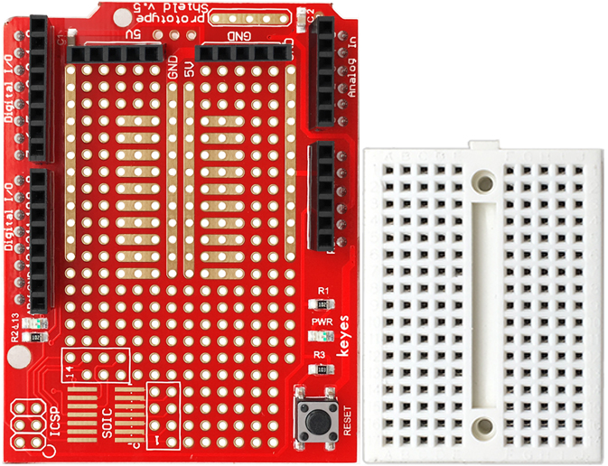
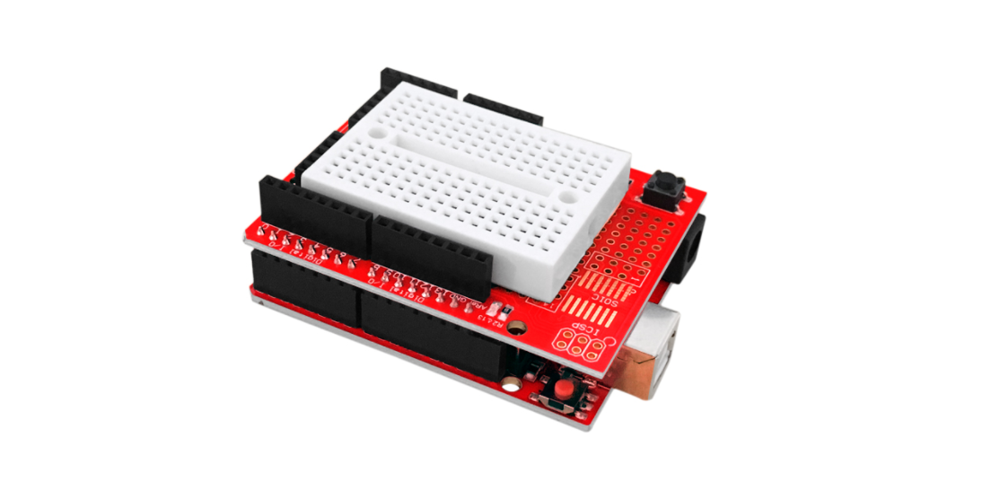
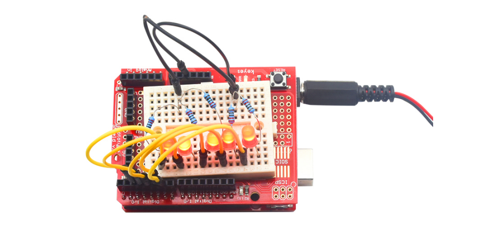

### KE0006 Keyes 原型扩展板详细说明

---

#### **1. 概述**
KE0006 Keyes 原型扩展板是一款与 Keyes UNO R3 开发板配合使用的扩展板，专为快速搭建电路原型设计。它提供了一个焊接区域和一个迷你面包板，用户可以直接在扩展板上焊接元件，或者通过面包板连接电路，方便快捷地进行电路设计和调试。

面包板与扩展板之间通过双面胶连接，用户可以根据需要选择是否将面包板固定在扩展板上。扩展板上还带有一个复位按键和一个电源指示灯，全部引脚和电源均已引出，能够直接与 Arduino UNO R3 等开发板配合使用，非常适合构建电路原型。

---

#### **2. 特点**
1. **兼容性强**：与 Keyes UNO R3 开发板完全兼容，也适用于其他 Arduino UNO 兼容开发板。
2. **多种连接方式**：支持焊接元件和使用迷你面包板两种方式，满足不同的电路搭建需求。
3. **复位按键和电源指示灯**：板载复位按键和电源指示灯，方便调试和状态监控。
4. **引脚完整引出**：所有数字、模拟引脚和电源引脚均已引出，便于连接外部模块。
5. **模块化设计**：面包板与扩展板分离设计，用户可根据需要灵活使用。
6. **高质量材料**：采用优质 PCB 板材，耐用性强，适合长期使用。

---

#### **3. 规格参数**
- **产品型号**：KE0006  
- **兼容性**：支持 Keyes UNO R3 和其他 Arduino UNO 兼容开发板  
- **焊接区域**：标准 2.54mm 间距焊接孔  
- **面包板孔数**：170 孔  
- **电源指示灯**：1 个  
- **复位按键**：1 个  
- **引脚类型**：全部数字、模拟引脚和电源引脚均已引出  
- **连接方式**：面包板通过双面胶与扩展板连接  

---

#### **4. 接口功能**
1. **焊接区域**：
   - 提供标准 2.54mm 间距的焊接孔，用户可以直接焊接元件，搭建永久性电路。
2. **迷你面包板**：
   - 提供 170 孔的面包板，适合快速搭建和测试电路。
   - 面包板通过双面胶与扩展板连接，用户可根据需要选择是否固定。
3. **复位按键**：
   - 板载复位按键，可直接复位连接的 Keyes UNO R3 开发板。
4. **电源指示灯**：
   - 板载电源指示灯，用于显示扩展板是否正常供电。
5. **引脚引出**：
   - 所有数字引脚（D0-D13）、模拟引脚（A0-A5）和电源引脚（5V、3.3V、GND）均已引出，便于连接外部模块或传感器。

---

#### **5. 适用场景**
1. **快速电路原型搭建**：
   - 使用焊接区域或面包板快速搭建和测试电路原型。
2. **电子学习与教学**：
   - 适合初学者学习电路设计和 Arduino 编程。
3. **模块化项目开发**：
   - 与 Keyes UNO R3 开发板配合使用，构建模块化电子项目。
4. **传感器与模块测试**：
   - 通过扩展板快速连接传感器和模块，进行功能测试。
5. **DIY 创意项目**：
   - 用于制作个人创意项目，如智能家居、机器人控制等。

---

#### **6. 怎么使用**
##### **1. 准备工作**
- 确保手头有 Keyes UNO R3 开发板、KE0006 原型扩展板、USB 数据线、Arduino IDE，以及需要的电子元件（如电阻、LED、传感器等）。

##### **2. 安装扩展板**
- 将 KE0006 原型扩展板插入 Keyes UNO R3 开发板的引脚接口，确保连接牢固。

##### **3. 使用面包板**
- 如果需要快速搭建电路，将迷你面包板通过双面胶固定在扩展板上。
- 将元件插入面包板，并通过跳线连接到扩展板的引脚。

##### **4. 使用焊接区域**
- 如果需要搭建永久性电路，可直接在扩展板的焊接区域焊接元件。

##### **5. 连接电路**
- 根据项目需求，将传感器、模块或其他元件连接到扩展板的引脚。

##### **6. 编写代码**
- 打开 Arduino IDE，编写或加载示例代码。
- 通过 USB 数据线将 Keyes UNO R3 开发板连接到电脑，上传代码。

##### **7. 测试电路**
- 观察电路运行情况，使用扩展板上的复位按键进行调试。

	

---

#### **7. 注意事项**
1. **面包板固定**：
   - 面包板通过双面胶与扩展板连接，用户可根据需要选择是否固定。
2. **焊接注意**：
   - 在焊接元件时，确保焊点牢固且无短路。
3. **供电电压**：
   - 确保供电电压在开发板支持的范围内（通常为 5V 或 3.3V）。
4. **引脚连接**：
   - 在连接外部模块时，确保引脚连接正确，避免短路或反接。
5. **复位按键**：
   - 使用复位按键时，注意避免误触导致程序中断。
6. **模块兼容性**：
   - 确保连接的模块或传感器与 Keyes UNO R3 开发板兼容。

---

#### **8. 参考链接**
- **Arduino 官网**：[https://www.arduino.cc/](https://www.arduino.cc/)  
  提供 Arduino IDE 下载、官方教程和示例代码。
- **Keyes 官网**：[http://www.keyes-robot.com/](http://www.keyes-robot.com/)  
  提供 Keyes 产品的详细信息和技术支持。
  可购买 Keyes UNO R3 开发板、KE0006 原型扩展板及其他配件。
- **Arduino 教程资源**：[https://www.arduino.cc/en/Tutorial/HomePage](https://www.arduino.cc/en/Tutorial/HomePage)  
  提供丰富的 Arduino 教程，适合初学者和进阶用户。

---

KE0006 Keyes 原型扩展板是一款功能强大、易于使用的扩展板，非常适合与 Keyes UNO R3 开发板配合使用。通过其焊接区域和迷你面包板，用户可以快速搭建和测试电路原型，轻松实现各种创意项目。

