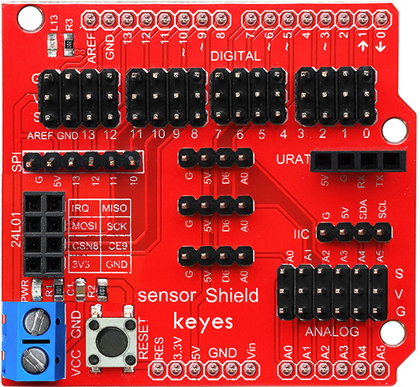
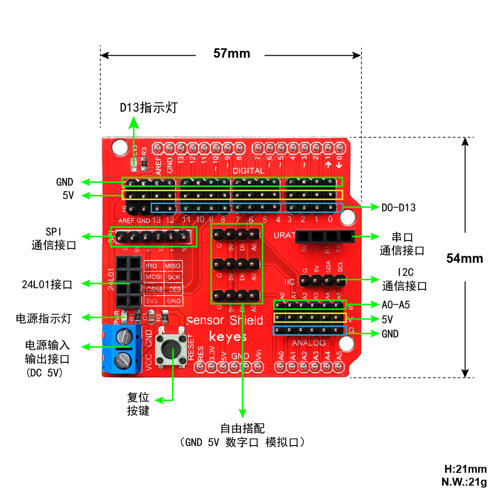
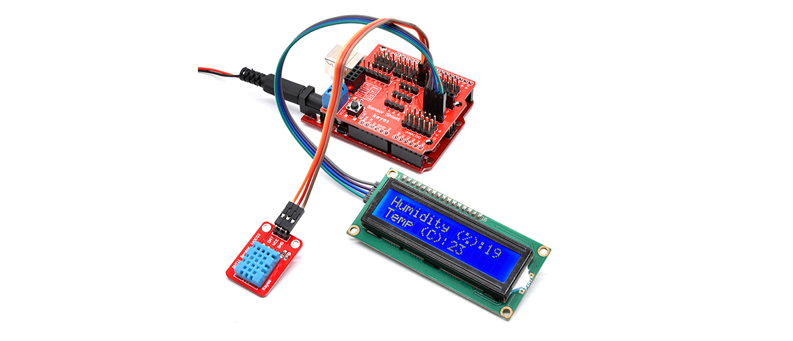
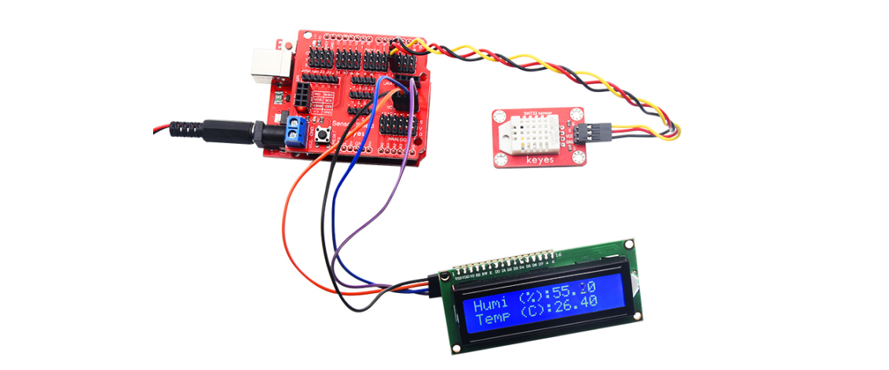

# KE0007 Keyes传感器扩展板详细说明

## 概述
Keyes KE0007 传感器扩展板是一款专为 Arduino 初学者设计的扩展板，主要与 Keyes UNO R3 开发板配合使用。它将 Keyes UNO R3 开发板的全部数字口和模拟口以舵机线序形式扩展出来，同时提供了丰富的接口，包括 IIC 接口、串口通信接口、SPI 通信接口、NRF24L01 无线模块通信接口等。通过这款扩展板，用户可以轻松连接各种传感器和模块，避免繁琐的电路连接问题，大大简化了开发过程。

这款扩展板特别适合 Arduino 初学者和电子爱好者使用，能够快速搭建项目原型，提升开发效率。

---

## 特点
1. **接口丰富**：支持数字口、模拟口、IIC、SPI、串口通信接口以及 NRF24L01 无线模块接口。
2. **简化连接**：采用通用 3P 传感器连接线，减少复杂的电路连接。
3. **模块化设计**：支持多种传感器和模块的快速连接，方便扩展功能。
4. **兼容性强**：专为 Keyes UNO R3 开发板设计，同时兼容其他 Arduino 开发板。
5. **易于使用**：无需焊接，插拔即可使用，适合初学者快速上手。
6. **高性价比**：功能全面，价格实惠，是学习 Arduino 和电子开发的理想选择。

---

## 规格参数
- **产品型号**：KE0007
- **适配开发板**：Keyes UNO R3（兼容 Arduino UNO R3）
- **扩展接口**：
  - 数字口：D0-D13
  - 模拟口：A0-A5
  - IIC 接口：SDA、SCL
  - SPI 接口：MISO、MOSI、SCK、SS
  - 串口通信接口：TX、RX
  - NRF24L01 无线模块接口
- **电源输入**：通过 Keyes UNO R3 开发板供电
- **连接方式**：3P 传感器连接线

---

## 接口功能
1. **数字口（D0-D13）**：
   - 用于连接数字传感器或模块，如按钮、LED、蜂鸣器等。
   - 每个数字口均以舵机线序形式（VCC、GND、信号）排列，方便连接。

2. **模拟口（A0-A5）**：
   - 用于连接模拟传感器，如光敏电阻、温度传感器等。
   - 同样以舵机线序形式排列。

3. **IIC 接口**：
   - 提供 SDA 和 SCL 引脚，用于连接 IIC 通信设备，如 OLED 屏幕、IIC 模块等。

4. **SPI 接口**：
   - 包括 MISO、MOSI、SCK 和 SS 引脚，用于连接 SPI 通信设备，如 SD 卡模块、RFID 模块等。

5. **串口通信接口**：
   - 提供 TX 和 RX 引脚，用于串口通信设备，如蓝牙模块、GPS 模块等。

6. **NRF24L01 无线模块接口**：
   - 专用接口，用于连接 NRF24L01 无线通信模块，支持无线数据传输。

---

## 适用场景
1. **Arduino 初学者学习**：
   - 简化电路连接，快速上手 Arduino 开发。
   
2. **电子项目原型开发**：
   - 快速搭建传感器网络或模块化项目。
   
3. **无线通信项目**：
   - 使用 NRF24L01 模块实现无线数据传输。
   
4. **智能家居**：
   - 连接温湿度传感器、光敏传感器等，开发智能家居应用。
   
5. **机器人开发**：
   - 连接舵机、超声波传感器等，开发机器人项目。
   
   	

---

## 怎么使用
1. **硬件连接**：
   - 将 Keyes KE0007 传感器扩展板插入 Keyes UNO R3 开发板。
   - 使用 3P 传感器连接线将传感器或模块连接到扩展板对应的接口。
   - 如果需要无线通信，将 NRF24L01 模块插入专用接口。

2. **软件配置**：
   - 下载并安装 Arduino IDE（[Arduino 官网](https://www.arduino.cc/)）。
   - 在 Arduino IDE 中选择对应的开发板（Arduino UNO）和端口。
   - 编写或导入代码，上传到开发板。

3. **运行项目**：
   - 连接传感器后，运行代码，观察传感器数据或模块功能是否正常工作。
   
   	

---

## 注意事项
1. **供电问题**：
   - 确保 Keyes UNO R3 开发板供电正常，避免因电压不足导致模块无法正常工作。
2. **接口匹配**：
   - 使用传感器时，确保连接到正确的接口（数字口或模拟口）。
3. **模块兼容性**：
   - 使用 IIC、SPI 或串口模块时，检查模块的通信协议是否与扩展板兼容。
4. **避免短路**：
   - 插拔传感器或模块时，建议断开电源，避免短路损坏设备。
5. **代码调试**：
   - 上传代码前，检查代码是否正确，避免因代码错误导致设备无法正常运行。

---

## 参考链接
1. [Arduino 官网](https://www.arduino.cc/)
2. [Keyes 官网](http://www.keyes-robot.com/)
3. [Arduino IDE 下载页面](https://www.arduino.cc/en/software)

