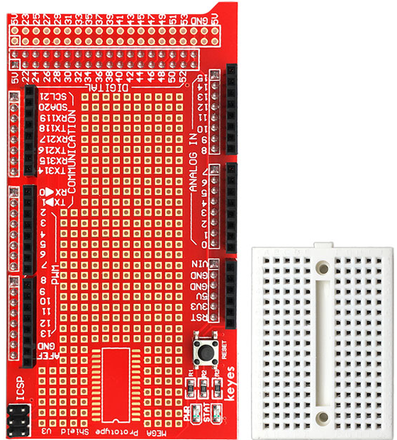
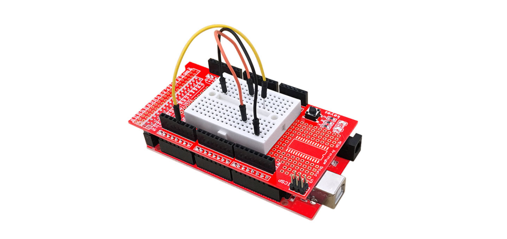
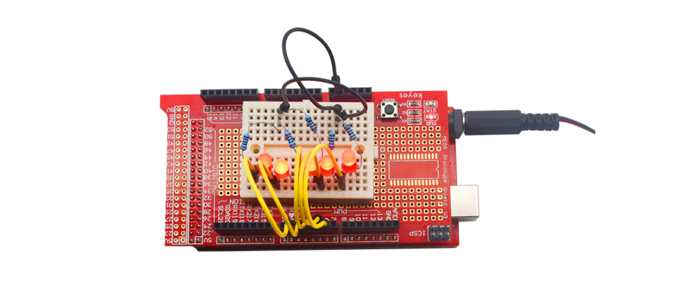

### KE0008 Keyes MEGA 2560 原型扩展板详细说明

---

#### **概述**
KE0008 Keyes MEGA 2560 原型扩展板是一款专为Arduino MEGA 2560 R3开发板设计的扩展板，主要用于搭建电路原型。它提供了一个便捷的平台，用户可以直接在扩展板上焊接元件，或者通过附带的迷你面包板快速连接电路。面包板通过双面胶与扩展板连接，用户可以根据需要自由拆装。所有引脚和电源接口均已引出，极大地方便了Arduino开发者进行原型设计和调试。

---

#### **特点**
1. **兼容性强**：专为Arduino MEGA 2560 R3设计，完美匹配开发板尺寸和接口。
2. **多种连接方式**：支持直接焊接元件或通过迷你面包板搭建电路。
3. **全引脚引出**：所有Arduino MEGA 2560的引脚均已引出，方便连接外部模块和传感器。
4. **电源接口丰富**：提供多种电源接口，支持5V和3.3V供电。
5. **模块化设计**：面包板与扩展板分离设计，用户可根据需求灵活使用。
6. **坚固耐用**：采用高质量PCB材料，耐用性强，适合长期使用。

---

#### **规格参数**
- **产品型号**：KE0008
- **适配开发板**：Arduino MEGA 2560 R3
- **尺寸**：与Arduino MEGA 2560 R3尺寸一致
- **引脚接口**：
  - 全部Arduino MEGA 2560引脚引出
  - 5V和3.3V电源接口
  - GND接地接口
- **面包板尺寸**：迷你面包板（170孔）
- **连接方式**：焊接或面包板连接
- **材质**：高质量双层PCB

---

#### **接口功能**
1. **引脚接口**：
   - 所有Arduino MEGA 2560的数字和模拟引脚均已引出，方便连接外部模块。
   
2. **电源接口**：
   - 提供5V和3.3V电源接口，支持不同电压需求的模块。
   - 提供多个GND接地接口，便于电路搭建。

3. **面包板区域**：
   - 提供一个迷你面包板，支持快速搭建电路。
   - 面包板通过双面胶与扩展板连接，可自由拆卸。

   

---

#### **适用场景**
1. **电路原型设计**：快速搭建和测试电路原型，适合初学者和开发者。
2. **Arduino项目开发**：与Arduino MEGA 2560 R3配合使用，构建各种电子项目。
3. **教学与实验**：用于电子电路教学和实验，帮助学生理解电路原理。
4. **模块调试**：连接传感器、执行器等模块，进行功能验证和调试。
5. **快速验证**：通过搭建简单电路快速验证程序逻辑和硬件功能。

---

#### **怎么使用**
1. **安装扩展板**：
   - 将KE0008原型扩展板插入Arduino MEGA 2560 R3开发板的引脚接口，确保连接牢固。
   
2. **连接面包板**：
   - 如果需要使用面包板，将迷你面包板通过双面胶固定在扩展板的指定区域。
   
3. **搭建电路**：
   - 根据项目需求，在面包板上搭建电路，或直接在扩展板上焊接元件。
   
4. **连接外部模块**：
   - 使用扩展板引出的接口连接传感器、执行器等外部模块。

5. **上传程序**：
   - 使用Arduino IDE编写并上传程序到Arduino MEGA 2560 R3开发板，测试电路功能。

   

---

#### **注意事项**
1. **电源选择**：
   - 确保使用与模块兼容的电源电压（5V或3.3V），避免损坏元件。
2. **焊接操作**：
   - 如果需要焊接元件，请确保焊接牢固，避免虚焊或短路。
3. **面包板使用**：
   - 面包板通过双面胶固定，拆装时请小心操作，避免损坏。
4. **引脚连接**：
   - 确保引脚连接正确，避免因接错引脚导致电路故障。
5. **避免过载**：
   - 不要在扩展板上连接超过其承载能力的负载，以免损坏电路。
6. **调试时注意安全**：
   - 在调试电路时，注意避免短路或误操作，确保人身和设备安全。

---

#### **参考链接**
1. [Arduino官网](https://www.arduino.cc)  
   提供Arduino MEGA 2560 R3的官方资料和开发工具下载。
2. [Keyes官网](http://www.keyes-robot.com)  
   提供KE0008原型扩展板的详细信息和其他Keyes产品。
3. [Arduino开发者社区](https://forum.arduino.cc)  
   提供丰富的开发案例和技术支持。