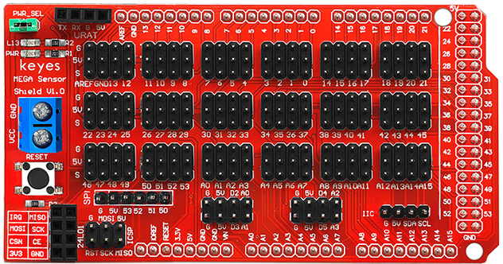
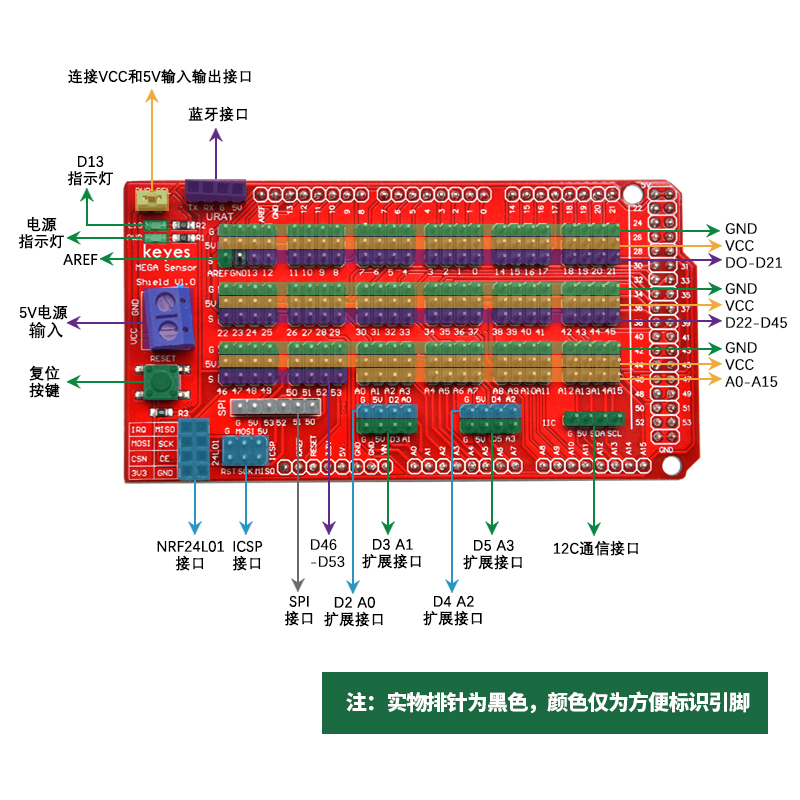
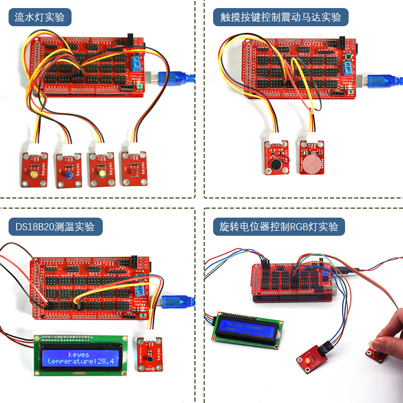

### KE0009 Keyes MEGA 2560 传感器扩展板详细说明

---

#### **概述**
KE0009 Keyes MEGA 2560 传感器扩展板是一款专为 Arduino MEGA 2560 R3 开发板设计的扩展板。它能够简化传感器与开发板的连接，提供丰富的接口支持，适合各种电子项目开发。通过将全部数字和模拟接口以舵机线序形式扩展，并提供串口通信接口、IIC通信接口、SPI通信接口等功能，KE0009 传感器扩展板让开发者能够快速搭建电路，减少复杂的接线工作。

该扩展板支持多种传感器模块的连接，使用通用的 3P 传感器连接线即可完成电路连接，极大地提高了开发效率，是物联网、机器人、智能家居等项目开发的理想选择。

---

#### **特点**
1. **全面扩展接口**：将 Arduino MEGA 2560 R3 的全部数字接口（D0-D53）和模拟接口（A0-A15）以舵机线序形式扩展，方便传感器连接。
2. **多种通信接口**：
   - 提供独立的串口通信接口（TX/RX）。
   - 支持 IIC 通信接口，便于连接 I2C 设备。
   - 提供 SPI 通信接口，支持高速数据传输。
3. **简化电路连接**：通过通用 3P 传感器连接线即可完成传感器与扩展板的连接，减少接线复杂度。
4. **电源管理**：支持外部电源输入，提供稳定的 5V 和 3.3V 电源输出，满足不同传感器的供电需求。
5. **易用性强**：接口布局清晰，标注明确，适合初学者和专业开发者使用。
6. **兼容性好**：专为 Arduino MEGA 2560 R3 设计，完美兼容其他 Keyes 系列传感器模块。

---

#### **规格参数**
- **适配开发板**：Arduino MEGA 2560 R3
- **数字接口**：D0-D53（舵机线序形式扩展）
- **模拟接口**：A0-A15（舵机线序形式扩展）
- **通信接口**：
  - 串口：TX/RX
  - IIC：SDA/SCL
  - SPI：MISO/MOSI/SCK/SS
- **电源输入**：外部电源接口（支持 6-12V 输入）
- **电源输出**：
  - 5V 输出
  - 3.3V 输出
- **接口类型**：3P 传感器连接线接口

---

#### **接口功能**
1. **数字接口（D0-D53）**：
   - 以舵机线序形式扩展，支持数字传感器、舵机、LED 等设备的连接。
2. **模拟接口（A0-A15）**：
   - 以舵机线序形式扩展，支持模拟传感器的连接。
3. **串口通信接口**：
   - 提供独立的 TX/RX 接口，支持与其他串口设备通信。
4. **IIC 通信接口**：
   - 提供 SDA 和 SCL 引脚，支持连接 I2C 设备，如 OLED 屏幕、温湿度传感器等。
5. **SPI 通信接口**：
   - 提供 MISO、MOSI、SCK 和 SS 引脚，支持高速数据传输设备，如 SD 卡模块。
6. **电源接口**：
   - 支持外部电源输入，提供稳定的 5V 和 3.3V 电源输出，满足不同设备的供电需求。

---

#### **适用场景**
1. **物联网项目**：快速搭建传感器网络，采集环境数据。
2. **机器人开发**：连接多种传感器和舵机，控制机器人运动。
3. **智能家居**：开发温湿度监控、光照检测等智能家居设备。
4. **教育与教学**：适合 Arduino 初学者和教学实验使用。
5. **快速原型开发**：简化电路连接，快速验证项目设计。

---

#### **怎么使用**
1. **硬件连接**：
   - 将 KE0009 传感器扩展板插入 Arduino MEGA 2560 R3 开发板。
   - 使用 3P 传感器连接线将传感器模块连接到扩展板的数字或模拟接口。
   - 根据需要连接外部电源，为扩展板和传感器供电。
   
2. **软件开发**：
   - 下载并安装 Arduino IDE（[Arduino 官网](https://www.arduino.cc/)）。
   - 在 Arduino IDE 中选择开发板类型为 “Arduino MEGA 2560”。
   - 编写或导入代码，调用对应的传感器库函数。
   - 上传代码到开发板，运行程序。
   
3. **调试与测试**：
   - 使用串口监视器查看传感器数据。
   - 根据需要调整代码或硬件连接。
   
   

---

#### **注意事项**
1. **电源选择**：
   - 如果传感器数量较多或功耗较大，建议使用外部电源供电，避免开发板电源不足。
2. **接口匹配**：
   - 确保传感器的接口类型与扩展板接口匹配（数字或模拟）。
3. **避免短路**：
   - 在连接传感器时，注意接口的正负极，避免短路损坏设备。
4. **代码兼容性**：
   - 使用传感器时，确保安装对应的 Arduino 库文件。
5. **环境保护**：
   - 避免在高温、高湿或强磁场环境下使用扩展板。

---

#### **参考链接**
1. **Arduino 官网**：[https://www.arduino.cc/](https://www.arduino.cc/)
2. **Keyes 官网**：[http://www.keyes-robot.com/](http://www.keyes-robot.com/)

