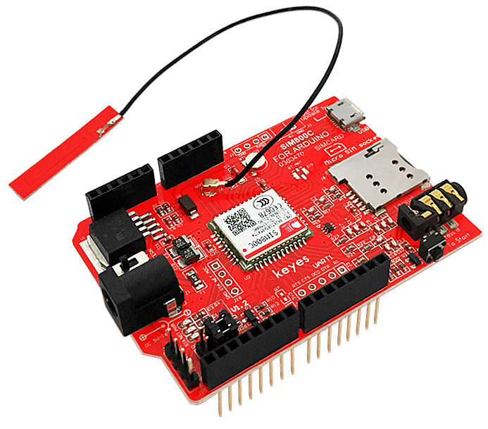
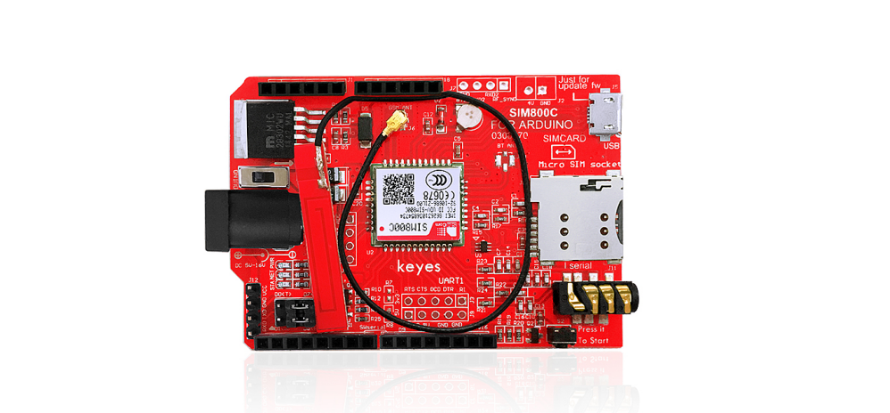
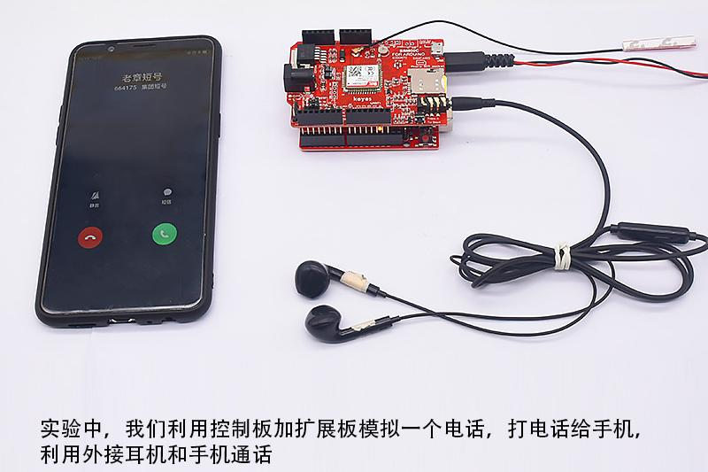

# KE0010 Keyes SIM800C GPRS/GSM扩展板



## 1. 概述 (Overview)
Keyes SIM800C GPRS/GSM扩展板是一款专为Arduino开发的通信模块扩展板，支持EGSM 900MHz/DCS 1800MHz和GSM850 MHz/PCS 1900MHz频段，结合了GPRS和DTMF功能。  
该模块具备DTMF功能，可以在通话过程中将按键转换为字符反馈，用于远程控制。通过AT指令控制，用户可以通过计算机串口或Arduino主板直接启动功能。  
SIM800C扩展板内嵌SIMCom的SIM800H芯片，确保稳定性和可靠性。

---

## 2. 特点 (Features)
- **四频段支持**：850/900/1800/1900MHz
- **低功耗模式**：睡眠模式下电流仅为0.7mA
- **DTMF功能支持**：实现按键字符反馈
- **AT指令控制**：通过串口发送AT指令实现功能控制
- **GPRS功能**：支持多槽类1~12的GPRS
- **LED指示灯**：显示供电状态、网络状态和工作模式
- **兼容Arduino**：支持与Arduino主板直接连接
- **串口波特率自适应**

---

## 3. 技术规格 (Specifications)
- **供电电压**：6-12V

- **低功耗**：100mA@7V（GSM模式）

- **频率支持**：850/900/1800/1900MHz

- **GPRS多槽类**：Class 1~12

- **移动站类别**：Class B

- **功率等级**：
  - 2W @ 850/900 MHz（Class 4）
  - 1W @ 1800/1900 MHz（Class 1）
  
- **控制方式**：AT指令

- **支持标准**：GSM Phase 2/2+

- **接口切换**：USB/Arduino控制切换

	

---

## 4. 接口功能 (Interface Functions)
1. **电源接口**：6-12V直流供电接口。
2. **SIM卡槽**：支持2G网络的SIM卡。
3. **耳机接口**：用于语音通话。
4. **串口通信接口**：用于与Arduino主板通信。
5. **LED指示灯**：
   - **电源指示灯**：显示模块供电状态。
   - **网络状态灯**：显示网络连接状态。
   - **工作模式灯**：指示模块的当前工作状态。
6. **控制开关**：切换USB与Arduino主板的控制模式。

---

## 5. 适用场景 (Applications)
- **远程控制**：通过DTMF功能实现远程设备控制。
- **语音通话**：支持语音拨号和接听电话。
- **短信服务**：发送和接收短信。
- **GPRS数据传输**：实现物联网设备的数据通信。
- **嵌入式通信**：用于智能家居、车联网等应用场景。

---

## 6. 使用方法 (How to Use)
### 6.1 硬件连接
1. 将SIM800C扩展板插入Arduino主板（例如Keyes UNO R3）。

2. 插入支持2G网络的SIM卡。

3. 连接耳机和麦克风（用于语音通话）。

4. 使用6-12V直流电源为模块供电。

	

### 6.2 软件设置
1. 下载并安装Arduino IDE（版本1.0或更高）。
2. 修改Arduino串口缓冲区大小：
   - 打开`HardwareSerial.cpp`或`HardwareSerial.h`文件。
   - 将`#define SERIAL_BUFFER_SIZE 64`修改为`#define SERIAL_BUFFER_SIZE 140`。
3. 导入相关库，编写或上传代码。

### 6.3 示例代码
以下是一个简单的拨号示例代码：
```cpp
#include <sim800cmd.h>

// 初始化库实例
Sim800Cmd sim800demo(fundebug);

void setup() {
    pinMode(13, OUTPUT); // 初始化数字引脚13为输出
    while ((sim800demo.sim800init()) == 0); // 初始化SIM800模块
}

void loop() {
    unsigned char csq = 0;
    if (sim800demo.callReadCSQ(&csq)) { // 获取信号强度
        sim800demo.dialTelephoneNumber("15912345678;"); // 拨打电话
        while (1);
    }
    digitalWrite(13, HIGH); // 点亮LED
    delay(500);
    digitalWrite(13, LOW); // 熄灭LED
    delay(500);
}

// 应用回调函数
void fundebug() {}
```

### 6.4 运行实验
1. 上传代码到Arduino主板。
2. 模块上电后，将自动拨打代码中设置的电话号码。
3. 使用耳机进行语音通话。

---

## 7. 注意事项 (Precautions)
1. **网络支持**：只支持2G网络，需确保SIM卡支持2G。
2. **供电要求**：推荐使用稳定的6-12V直流电源，避免电压不足导致模块重启。
3. **天线安装**：确保天线安装牢固以获得更好的信号强度。
4. **串口缓冲区**：修改Arduino串口缓冲区大小以避免数据丢失。
5. **静电防护**：在操作模块时，注意静电防护，避免损坏模块。

---

## 8. 参考链接 (References)
- [Arduino官网](https://www.arduino.cc/)
- [Keyes官网](http://www.keyes-robot.com/)
- [SIM800官方文档](https://simcom.ee/documents/)
- [GPRS通信教程](https://create.arduino.cc/projecthub)

---

