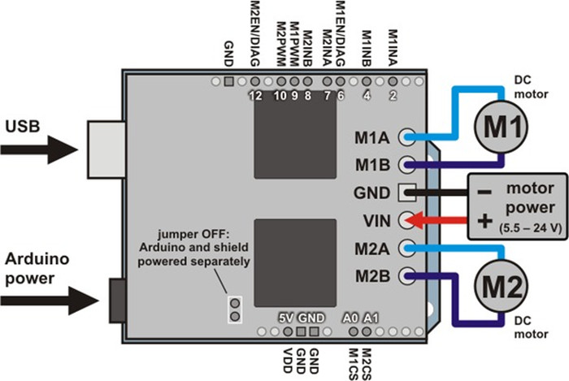

# KE0104 keyes VNH5019双路电机驱动扩展板


## 1. 概述

**Keyes VNH5019 双路电机驱动扩展板**采用 ST 公司生产的 VNH5019 芯片，可同时驱动两路直流电机，单路连续电流可达 12A，短时峰值可达 30A。它支持 5.5V～24V 的驱动电压范围，能够满足多种中高功率直流电机的应用需求。  
该扩展板可直接插在 Arduino UNO R3 等兼容主控板上，板载上拉、电阻、防反接电路等保护元件，提供完整的驱动方案。与常见的 L298 系列驱动器相比，VNH5019 在效率、功率和保护功能方面均有大幅提升。

**适用场景：**  
- 智能小车、竞技机器人、搬运机器人  
- 机械臂、履带式车辆、自动门控制  
- DIY 高功率电机项目

---

## 2. 主要规格参数

| 参数                     | 值                                                   |
|--------------------------|------------------------------------------------------|
| **驱动芯片**            | ST VNH5019                                          |
| **工作电压范围**        | 5.5V ～ 24V                                          |
| **单通道连续输出电流**  | 12A                                                 |
| **单通道最大输出电流**  | 30A（短时峰值）                                       |
| **驱动通道**            | 2 路                                                |
| **电流检测值**          | 0.14 V/A                                            |
| **最大 PWM 频率**       | 20kHz                                               |
| **保护功能**            | 过流、过热、欠压锁定、反向电压保护                     |
| **逻辑电压**            | 5V（与 Arduino 等控制器 IO 相容）                      |

> 注：使用中若电流接近 12A（甚至峰值 30A），需做好散热设计，防止芯片过热导致保护或损坏。

---

## 3. 工作原理

VNH5019 是一款集成 H 桥驱动的功率芯片，可通过 GPIO 方向引脚 (INxA / INxB) + PWM 控制引脚，提供对电机的正反转及调速。  
- **方向控制**：两路信号决定电流流向，进而控制正转或反转。  
- **PWM 调速**：在使能 (Enable) 或 PWM 引脚输入占空比 (0～100%)，即可调节输出电压平均值，控制电机转速。  
- **内置保护**：当出现过流、过热或电压异常时，芯片会自动关断输出，保护芯片及电机。


---

## 4. 扩展板与 Arduino 连接示意

下图示例采用 Arduino UNO 控制两台直流电机。请根据板上丝印或商家说明，确认以下引脚对应关系（可能略有差异）。



---

## 5. 接口说明

可根据扩展板或示意图查阅具体丝印。一般会包含：  
- **VIN / GND (电机电源)**：输入 5.5V～24V，为电机提供高功率电源；  
- **5V / GND (逻辑电源)**：5V（可来自 Arduino UNO）为内部逻辑及上拉电阻供电；  
- **IN1A/IN1B、IN2A/IN2B**：每路电机的方向控制引脚；  
- **ENA / ENB (或 PWM1 / PWM2)**：每路 PWM 调速引脚；  
- **EN1DIAG1 / EN1DIAG2**：可用来监测故障或使能引脚；  
- **OUT1A / OUT1B、OUT2A / OUT2B**：连接到每一路 DC 电机的两极。


---

## 6. 测试代码

下面的代码示例演示如何通过 Arduino UNO 来控制 VNH5019 扩展板的两路电机，实现“1 秒正转、1 秒停、1 秒反转、1 秒停”的循环。代码中你可根据实际接线情况修改引脚定义。

```cpp
// 测试代码：Keyes VNH5019 双路电机驱动扩展板
// 电机1: IN1 (2), IN2(4), (ENA=9), EN1DIAG1(6)
// 电机2: IN3(7), IN4(8), (ENB=10), EN1DIAG2(12)

int IN1 = 2;
int IN2 = 4;
int IN3 = 7;
int IN4 = 8;
int ENA = 9;      // PWM for Motor1
int ENB = 10;     // PWM for Motor2
int EN1DIAG1 = 6; // Fault/Enable for Motor1
int EN1DIAG2 = 12;// Fault/Enable for Motor2

void setup() {
  // 设置控制引脚为输出模式
  for (int pin = 2; pin <= 12; pin++) {
    pinMode(pin, OUTPUT);
  }
}

void loop() {
  // 1. 电机正转
  digitalWrite(EN1DIAG1, HIGH);
  digitalWrite(EN1DIAG2, HIGH);
  // 设置占空比（速度）
  analogWrite(ENA, 100);  
  analogWrite(ENB, 100);  
  // 方向：IN1=LOW, IN2=HIGH 表示电机1正转，IN3=LOW, IN4=HIGH 表示电机2正转
  digitalWrite(IN1, LOW);
  digitalWrite(IN2, HIGH);
  digitalWrite(IN3, LOW);
  digitalWrite(IN4, HIGH);
  
  delay(2000);

  // 2. 停止1秒
  analogWrite(ENA, 200);
  analogWrite(ENB, 200);
  digitalWrite(IN1, LOW);
  digitalWrite(IN2, LOW);
  digitalWrite(IN3, LOW);
  digitalWrite(IN4, LOW);
  delay(1000);

  // 3. 电机反转
  analogWrite(ENA, 200);
  analogWrite(ENB, 200);
  digitalWrite(IN1, HIGH);
  digitalWrite(IN2, LOW);
  digitalWrite(IN3, HIGH);
  digitalWrite(IN4, LOW);
  delay(2000);

  // 4. 再次停止1秒
  analogWrite(ENA, 200);
  analogWrite(ENB, 200);
  digitalWrite(IN1, LOW);
  digitalWrite(IN2, LOW);
  digitalWrite(IN3, LOW);
  digitalWrite(IN4, LOW);
  delay(1000);
}
```

> 在代码中，`analogWrite()` 取值范围 0～255，数值越大输出电压占空比越高，电机转速越快。

---

## 7. 测试结果/实验现象

- 接线完毕后，将此示例代码上传至 Arduino UNO 并上电：  
  - 电机 1 与电机 2 会先正转 2 秒、停 1 秒，然后反转 2 秒、停 1 秒，如此循环。 
  - 由于正转时占空比设置为 100、反转时为 200，可观察到反转时速度更快。  
- 若在运行时电机堵转或负载过大，VNH5019 可能触发保护功能（输出关断），可通过故障引脚 (EN1DIAG1 / EN1DIAG2) 检测故障状态。  
- 在高电流运行时，需要关注散热。若温度过高，可能进入过热保护状态。


---

## 8. 注意事项

1. **电源匹配**：外接电源电压需适配电机额定值，并可提供足量工作电流。  
2. **散热设计**：高负载时请加装散热片或风扇，避免芯片因过热而关断。  
3. **共地**：驱动板的 GND 与 Arduino 的 GND、外部电源 GND 必须连通。  
4. **PWM 频率**：Arduino UNO 默认的 PWM 引脚在 ~490Hz 或 ~980Hz（具体端口不同），如需更高频率可通过定时器配置实现，VNH5019 的上限是 20kHz。  
5. **正确接线**：千万要注意电源极性、电机接口不要反接、不可短路。  
6. **调试时注意安全**：高电流驱动电机时，注意避免电机转速过高或大力矩伤人。

## 9. 参考链接
- [Keyes 官网](http://www.keyes-robot.com/)  
- [Arduino 官网](https://www.arduino.cc/)  