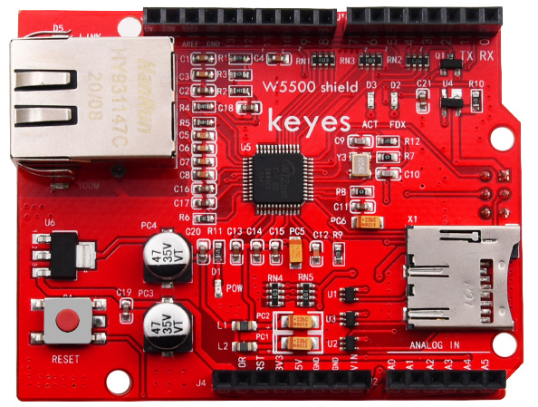
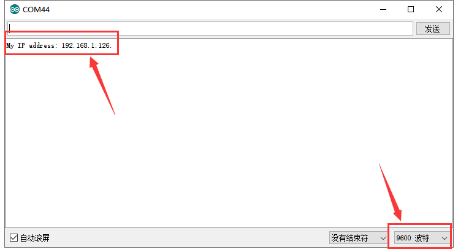
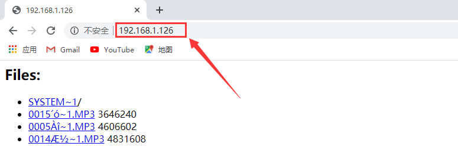
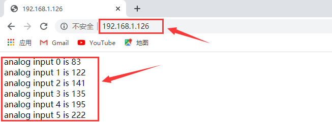

# KE0156 KEYES W5500网络扩展板



---

## 1. 说明
**KEYES W5500网络扩展板** 板载以 W5500 为核心的网络模块，可以使其成为简单的 Web 服务器，或者通过网络控制读写的数字和模拟接口等网络应用。它可以同时兼容 KEYES UNO R3 开发板和 KEYES 2560 R3 开发板。

使用时，我们可以在控制板上上传对应程序，实现一个简单的 Web 服务器。同时，该扩展板还支持 mini SD 卡（TF 卡，最大支持内存为 1G）读写。这个扩展板采用了可堆叠的设计，可直接插到控制板上，同时其他扩展板也可以插在这个扩展板上。扩展板还自带 4 个直径为 3mm 的固定孔，方便固定到其他设备。

---

## 2. 技术参数
- **输入电压**：DC 5V  
- **工作电压**：DC 3.3V  
- **工作电流**：约 380mA  
- **最大功率**：3W  
- **工作温度**：-55℃ ～ +75℃  
- **网络变压器接口类型**：RJ-45 接口  
- **排母间距**：2.54mm  
- **固定孔直径**：3mm  
- **尺寸**：69mm × 53mm × 28mm  
- **重量**：24.5g  
- **mini SD 卡（TF 卡）大小**：最大 1G  
- **TF 卡座**：自弹出式  

**W5500 特性**：
- 全硬件 TCP/IP 协议栈网络芯片
- 支持高速 SPI 总线（SPI 模式 0，3）
- 支持硬件 TCP/IP 协议：TCP, UDP, ICMP, IPv4 ARP, IGMP, PPPoE
- 内嵌 10/100Mbps 以太网物理层
- 支持自动应答（全双工/半双工模式）
- 多种指示灯信号输出（全/半双工）
- 支持 8 个独立的端口同时连接
- 内部 32K 字节存储器作 TX/RX 缓存
- 支持休眠模式和网络唤醒
- 3.3V 工作电压，I/O 口可承受 5V 电压
- 极小巧的 48P/N LQFP 无铅封装

---

## 3. 测试代码
注意：上传代码之前，必须将对应的库文件放置到安装 Arduino IDE 的库文件夹中。

### 代码 A
```cpp
#include <SPI.h>
#include <Ethernet55.h>

// set MAC address 
#if defined(WIZ550io_WITH_MACADDRESS) // Use assigned MAC address of WIZ550io
;
#else
byte mac[] = {0xDE, 0xAD, 0xBE, 0xEF, 0xFE, 0xED};
#endif  

void setup() 
{  
  Serial.begin(9600);
  if (Ethernet.begin(mac) == 0) 
  {
      Serial.println("Failed to configure Ethernet using DHCP");
      // connection fails, stop program run. 
      for(;;);
  }
  // print out your local IP address
  Serial.print("My IP address: ");
  for (byte thisByte = 0; thisByte < 4; thisByte++) 
  {
    // print out four byte IP address
    Serial.print(Ethernet.localIP()[thisByte], DEC);
    Serial.print("."); 
  }
  Serial.println();
}

void loop() 
{
}
```

### 代码 B
```cpp
#include <SdFat.h>
#include <SdFatUtil.h>
#include <Ethernet55.h>
#include <SPI.h>

/************ ETHERNET STUFF ************/
byte mac[] = { 0xDE, 0xAD, 0xBE, 0xEF, 0xFE, 0xED };  //MAC address
byte ip[] = { 192, 168, 1, 126 };     //IP address
EthernetServer server(80);

/************ SDCARD STUFF ************/
Sd2Card card;
SdVolume volume;
SdFile root;
SdFile file;

// store error strings in flash to save RAM
#define error(s) error_P(PSTR(s))

void error_P(const char* str) {
  PgmPrint("error: ");
  SerialPrintln_P(str);
  if (card.errorCode()) {
    PgmPrint("SD error: ");
    Serial.print(card.errorCode(), HEX);
    Serial.print(',');
    Serial.println(card.errorData(), HEX);
  }
  while(1);
}

void setup() {
  Serial.begin(9600);

  PgmPrint("Free RAM: ");
  Serial.println(FreeRam());  

  // initialize the SD card at SPI_HALF_SPEED to avoid bus errors with
  // breadboards.  use SPI_FULL_SPEED for better performance.
  pinMode(10, OUTPUT);                       // set the SS pin as an output (necessary!)
  digitalWrite(10, HIGH);                    // but turn off the W5500 chip!

  if (!card.init(SPI_HALF_SPEED, 4)) error("card.init failed!");

  // initialize a FAT volume
  if (!volume.init(&card)) error("vol.init failed!");

  PgmPrint("Volume is FAT");
  Serial.println(volume.fatType(),DEC);
  Serial.println();

  if (!root.openRoot(&volume)) error("openRoot failed");

  // list file in root with date and size
  PgmPrintln("Files found in root:");
  root.ls(LS_DATE | LS_SIZE);
  Serial.println();

  // Recursive list of all directories
  PgmPrintln("Files found in all dirs:");
  root.ls(LS_R);

  Serial.println();
  PgmPrintln("Done");

  // Debugging complete, we start the server!
  Ethernet.begin(mac, ip);
  server.begin();
}

void ListFiles(EthernetClient client, uint8_t flags) {
  // This code is just copied from SdFile.cpp in the SDFat library
  // and tweaked to print to the client output in html!
  dir_t p;

  root.rewind();
  client.println("<ul>");
  while (root.readDir(&p) > 0) {
    // done if past last used entry
    if (p.name[0] == DIR_NAME_FREE) break;

    // skip deleted entry and entries for . and  ..
    if (p.name[0] == DIR_NAME_DELETED || p.name[0] == '.') continue;

    // only list subdirectories and files
    if (!DIR_IS_FILE_OR_SUBDIR(&p)) continue;

    // print any indent spaces
    client.print("<li><a href=\"");
    for (uint8_t i = 0; i < 11; i++) {
      if (p.name[i] == ' ') continue;
      if (i == 8) {
        client.print('.');
      }
      client.print((char)p.name[i]);
    }
    client.print("\">");

    // print file name with possible blank fill
    for (uint8_t i = 0; i < 11; i++) {
      if (p.name[i] == ' ') continue;
      if (i == 8) {
        client.print('.');
      }
      client.print((char)p.name[i]);
    }

    client.print("</a>");

    if (DIR_IS_SUBDIR(&p)) {
      client.print('/');
    }

    // print modify date/time if requested
    if (flags & LS_DATE) {
       root.printFatDate(p.lastWriteDate);
       client.print(' ');
       root.printFatTime(p.lastWriteTime);
    }
    // print size if requested
    if (!DIR_IS_SUBDIR(&p) && (flags & LS_SIZE)) {
      client.print(' ');
      client.print(p.fileSize);
    }
    client.println("</li>");
  }
  client.println("</ul>");
}

// How big our line buffer should be. 100 is plenty!
#define BUFSIZ 100

void loop()
{
  char clientline[BUFSIZ];
  int index = 0;

  EthernetClient client = server.available();
  if (client) {
    // an http request ends with a blank line
    boolean current_line_is_blank = true;

    // reset the input buffer
    index = 0;

    while (client.connected()) {
      if (client.available()) {
        char c = client.read();

        // If it isn't a new line, add the character to the buffer
        if (c != '\n' && c != '\r') {
          clientline[index] = c;
          index++;
          // are we too big for the buffer? start tossing out data
          if (index >= BUFSIZ) 
            index = BUFSIZ -1;

          // continue to read more data!
          continue;
        }
        // got a \n or \r new line, which means the string is done
        clientline[index] = 0;
        // Print it out for debugging
        Serial.println(clientline);

        // Look for substring such as a request to get the root file
        if (strstr(clientline, "GET / ") != 0) {
          // send a standard http response header
          client.println("HTTP/1.1 200 OK");
          client.println("Content-Type: text/html");
          client.println();

          // print all the files, use a helper to keep it clean
          client.println("<h2>Files:</h2>");
          ListFiles(client, LS_SIZE);
        } else if (strstr(clientline, "GET /") != 0) {
          // this time no space after the /, so a sub-file!
          char *filename;

          filename = clientline + 5; // look after the "GET /" (5 chars)
          // a little trick, look for the " HTTP/1.1" string and 
          // turn the first character of the substring into a 0 to clear it out.
          (strstr(clientline, " HTTP"))[0] = 0;

          // print the file we want
          Serial.println(filename);

          if (! file.open(&root, filename, O_READ)) {
            client.println("HTTP/1.1 404 Not Found");
            client.println("Content-Type: text/html");
            client.println();
            client.println("<h2>File Not Found!</h2>");
            break;
          }

          Serial.println("Opened!");

          client.println("HTTP/1.1 200 OK");
          client.println("Content-Type: text/plain");
          client.println();

          int16_t c;
          while ((c = file.read()) > 0) {
              // uncomment the serial to debug (slow!)
              //Serial.print((char)c);
              client.print((char)c);
          }
          file.close();
        } else {
          // everything else is a 404
          client.println("HTTP/1.1 404 Not Found");
          client.println("Content-Type: text/html");
          client.println();
          client.println("<h2>File Not Found!</h2>");
        }
        break;
      }
    }
    // give the web browser time to receive the data
    delay(1);
    client.stop();
  }
}
```

### 代码 C
```cpp
#include <SPI.h>
#include <Ethernet55.h>

// Enter a MAC address and IP address for your controller below.
// The IP address will be dependent on your local network:
byte mac[] = {0xDE, 0xAD, 0xBE, 0xEF, 0xFE, 0xED };
IPAddress ip(192,168,1,126);//modifying according your own IP

// Initialize the Ethernet server library
// with the IP address and port you want to use
// (port 80 is default for HTTP):
EthernetServer server(80);

void setup() {
  // Open serial communications and wait for port to open:
  Serial.begin(9600);
  while (!Serial) {
    ; // wait for serial port to connect. Needed for Leonardo only
  }
  // start the Ethernet connection and the server:
  Ethernet.begin(mac, ip);
  server.begin();
  Serial.print("server is at ");
  Serial.println(Ethernet.localIP());
}

void loop() {
  // listen for incoming clients
  EthernetClient client = server.available();
  if (client) {
    Serial.println("new client");
    // an http request ends with a blank line
    boolean currentLineIsBlank = true;
    while (client.connected()) {
      if (client.available()) {
        char c = client.read();
        Serial.write(c);
        // if you've gotten to the end of the line (received a newline
        // character) and the line is blank, the http request has ended,
        // so you can send a reply
        if (c == '\n' && currentLineIsBlank) {
          // send a standard http response header
          client.println("HTTP/1.1 200 OK");
          client.println("Content-Type: text/html");
          client.println("Connection: close"); // the connection will be closed after completion
          // of the response
          client.println("Refresh: 1"); // refresh the page automatically every 1 sec
          client.println();
          client.println("<!DOCTYPE HTML>");
          client.println("<html>");
          // output the value of each analog input pin
          for (int analogChannel = 0; analogChannel < 6; analogChannel++) {
            int sensorReading = analogRead(analogChannel);
            client.print("analog input ");
            client.print(analogChannel);
            client.print(" is ");
            client.print(sensorReading);
            client.println("<br />");
          }
          client.println("</html>");
          break;
        }
        if (c == '\n') {
          // you're starting a new line
          currentLineIsBlank = true;
        } else if (c != '\r') {
          // you've gotten a character on the current line
          currentLineIsBlank = false;
        }
      }
    }
  }
  // give the web browser time to receive the data
  delay(1);
  // close the connection:
  client.stop();
  Serial.println("client disconnected");
}
```

---

## 4. 测试结果

特别注意：我们测试时用的是 1.5.6 版本的 IDE，其他版本 IDE 可能不兼容。

1. 测试前，应先将用到的库文件放至相应的 IDE 库目录里面。

2. 测试时，利用方形接口 USB 线将控制板连接到电脑上。将扩展板堆叠在控制板上，在扩展板的网络变压器接口连接对应网线，将 mini SD 卡（TF 卡）插在扩展板 TF 卡座。

3. 上传代码 A，上传完成后，打开串口监视器，设置波特率为 9600，按下复位按键，就可以看到相应的网络 IP 地址，为 192.168.1.126。

	

4. 再将上传代码 B，代码 B 中的 IP 地址应当更改为上传代码 A 获取到的 IP 地址。上传成功，上电后，在浏览器地址栏输入获取的 IP 地址后，能在网页中显示当前 SD 卡中的内容。

	

5. 再将上传代码 C，代码 C 中的 IP 地址应当更改为上传代码 A 获取到的 IP 地址。上传成功，上电后，在浏览器地址栏输入获取的 IP 地址后，能在网页中显示 UNO 板上 A0-A5 读取的 6 个模拟值，每隔 1 秒刷新 1 次。

	

---

## 5. 相关资料链接
- [百度网盘资料链接](https://pan.baidu.com/s/1a3LsMlRCN_3G1PhWD016eA)  
  提取码：uxro  

如有更多疑问，请联系 Keyes 官方客服或加入相关创客社区交流。祝使用愉快！