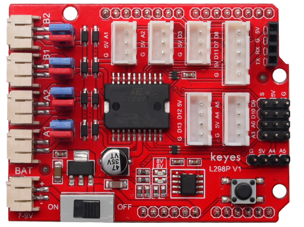
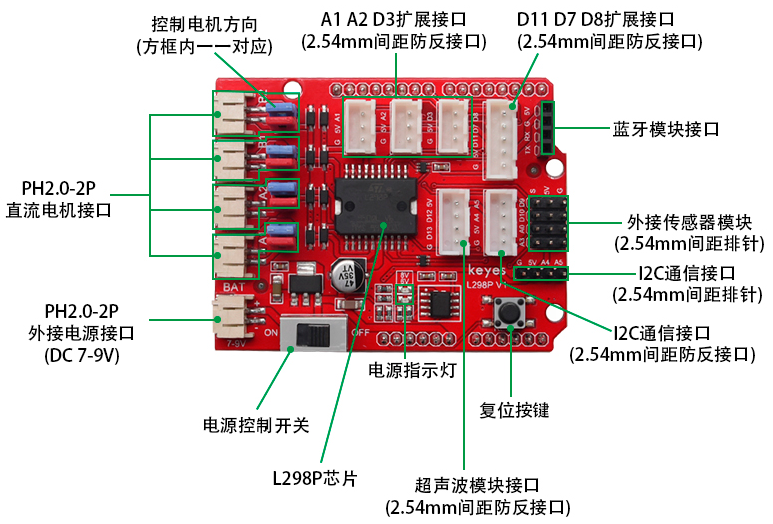
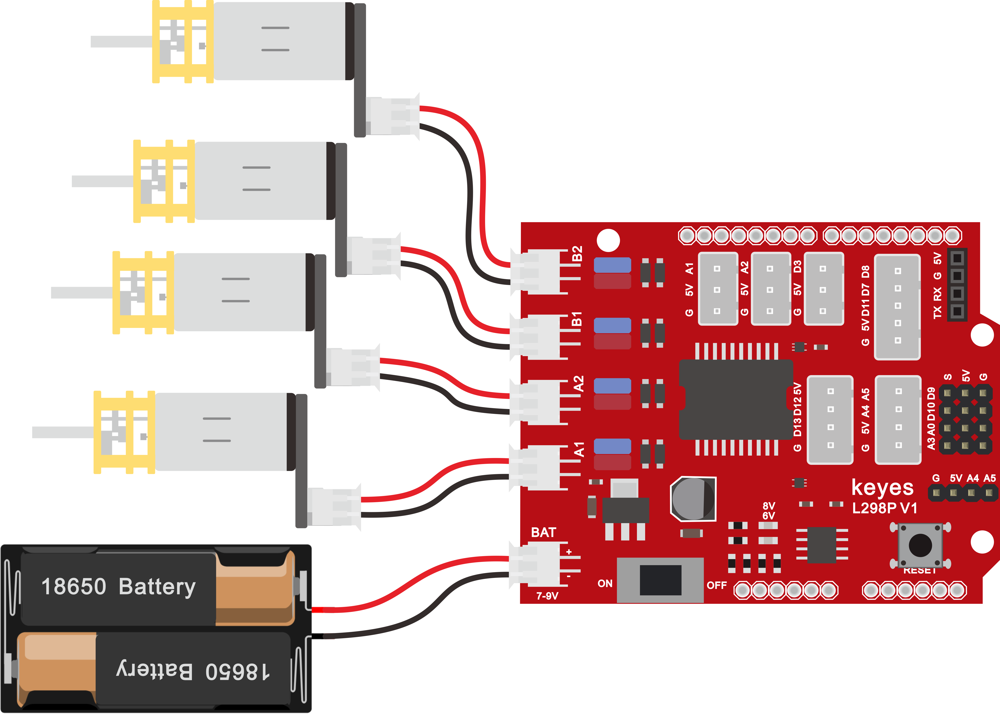
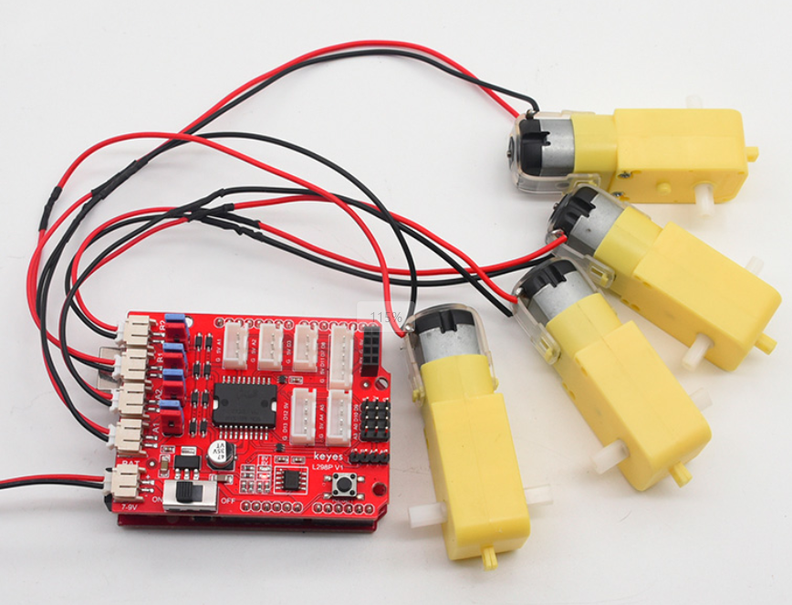

# KE0163 Keyes Brick L298P 电机驱动扩展板 V1 红色 环保



## 1. 介绍
**Keyes Brick L298P 电机驱动扩展板** 是基于 L298P 驱动芯片设计的电机驱动扩展板，能够驱动直流电机和步进电机。该扩展板采用叠层设计，可以直接插接到 Arduino UNO R3 板上，简化了电机驱动的连接和控制过程。

---

## 2. 特点
- **高功率驱动**：支持最大 2A 的电流输出，适合驱动大功率电机。
- **多种接口**：提供多种接口，方便连接不同类型的电机和传感器。
- **防反接设计**：电源接口采用防反接设计，保护电路安全。
- **LED 指示灯**：提供电源状态指示，便于调试和使用。
- **兼容性强**：与市面上常用的蓝牙模块兼容，便于扩展功能。

---

## 3. 规格参数
- **输入电压**：DC 7-9V  
- **逻辑部分工作电流**：< 36mA  
- **驱动部分工作电流**：< 2A  
- **最大耗散功率**：25W（T=75℃）  
- **控制信号输入电平**：高电平 2.3V < Vin < 5V，低电平 -0.3V < Vin < 1.5V  
- **工作温度**：-25℃ ~ +130℃  
- **尺寸**：69mm × 53mm × 26mm  
- **重量**：25.2g  

---

## 4. 工作原理
L298P 驱动芯片通过控制输入信号来调节电机的转动方向和速度。扩展板上集成了必要的电路和接口，使得用户可以方便地连接电机和控制信号。通过 PWM 信号控制电机的转速，数字信号控制电机的正反转。

---

## 5. 接口说明
- **电源接口**：PH2.0-2P 防反接口，连接外部电源。
- **电机接口**：可连接 4 个直流电机，支持并联控制。
- **LED 指示灯**：
  - **6V LED**：外接电源低于 6.2V 时熄灭，高于 6.2V 时亮起。
  - **8V LED**：外接电源低于 8V 时熄灭，高于 8V 时亮起。
- **串口通讯接口**：兼容 HC-06、HM-10 等蓝牙模块。
- **扩展接口**：提供多个 XH-2.54mm 接口，方便连接传感器和其他模块。



---

## 6. 连接图


---

## 7. 示例代码
以下是控制电机的示例代码：
```cpp
// 电机控制脚
#define EN_L 5                 // L298N使能 左电机使能
#define EN_R 6                 // L298N使能 右电机使能
#define Motor_Right  2         // L298N IN2  右电机控制正反转
#define Motor_Left  4          // L298N IN3  左电机控制正反转

void setup() 
{ 
  pinMode(Motor_Right, OUTPUT); 
  pinMode(Motor_Left, OUTPUT); 
  pinMode(EN_L, OUTPUT);
  pinMode(EN_R, OUTPUT);
} 

// 小车前进
void advance()    
{
  analogWrite(EN_L, 200); 
  analogWrite(EN_R, 200); 
  digitalWrite(Motor_Right, HIGH);  
  digitalWrite(Motor_Left, HIGH);      
}

// 小车后退
void back() 
{
  analogWrite(EN_L, 200); 
  analogWrite(EN_R, 200); 
  digitalWrite(Motor_Right, LOW);
  digitalWrite(Motor_Left, LOW);   
}

// 小车左旋转
void left() 
{
  analogWrite(EN_L, 200); 
  analogWrite(EN_R, 200); 
  digitalWrite(Motor_Right, HIGH);
  digitalWrite(Motor_Left, LOW);   
}

// 小车右旋转
void right() 
{
  analogWrite(EN_L, 200); 
  analogWrite(EN_R, 200); 
  digitalWrite(Motor_Right, LOW);
  digitalWrite(Motor_Left, HIGH);   
}

// 小车停止
void stopp()  
{
  analogWrite(EN_L, 0); 
  analogWrite(EN_R, 0); 
}

void loop()
{
  advance();
  delay(1000);
  stopp();
  delay(200);
  back();
  delay(1000);
  stopp();
  delay(200);
  left();
  delay(1000);
  stopp();
  delay(200);
  right();
  delay(1000);
  stopp();
  delay(200);
}
```

---

## 8. 实验现象
在 UNO R3 控制上传好测试代码后，将扩展板堆叠在 UNO R3 控制板，按照接线图接线，上电后，两个电机模拟小车运动转动，模拟小车前进 1 秒，停止 0.2 秒；后退 1 秒，停止 0.2 秒；左旋转 1 秒，停止 0.2 秒；右旋转 1 秒，停止 0.2 秒；循环交替。



---

## 9. 注意事项
- 确保电源电压在规定范围内，避免损坏电路。
- 在连接电机时，注意电机的极性，避免反向连接。
- 使用 PWM 信号控制电机速度时，确保信号频率适当。
- 在调试过程中，注意观察 LED 指示灯状态，及时排查故障。

---

## 10. 参考链接
- [Keyes 官方网站](http://www.keyes.com.cn)  
- [Arduino 官方网站](https://www.arduino.cc)  
- [L298P 数据手册](https://www.st.com/resource/en/datasheet/l298.pdf)  
- [Arduino PWM 控制](https://www.arduino.cc/en/Tutorial/BuiltInExamples/AnalogWrite)  
- [HC-06 蓝牙模块说明](https://www.electronicwings.com/nrf/hc-06-bluetooth-module)  

如有更多疑问，请联系 Keyes 官方客服或加入相关创客社区交流。祝使用愉快！