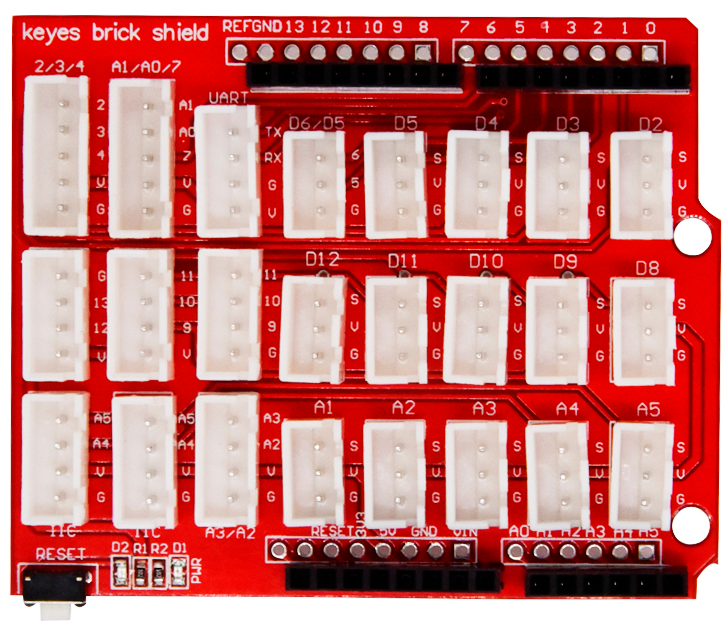
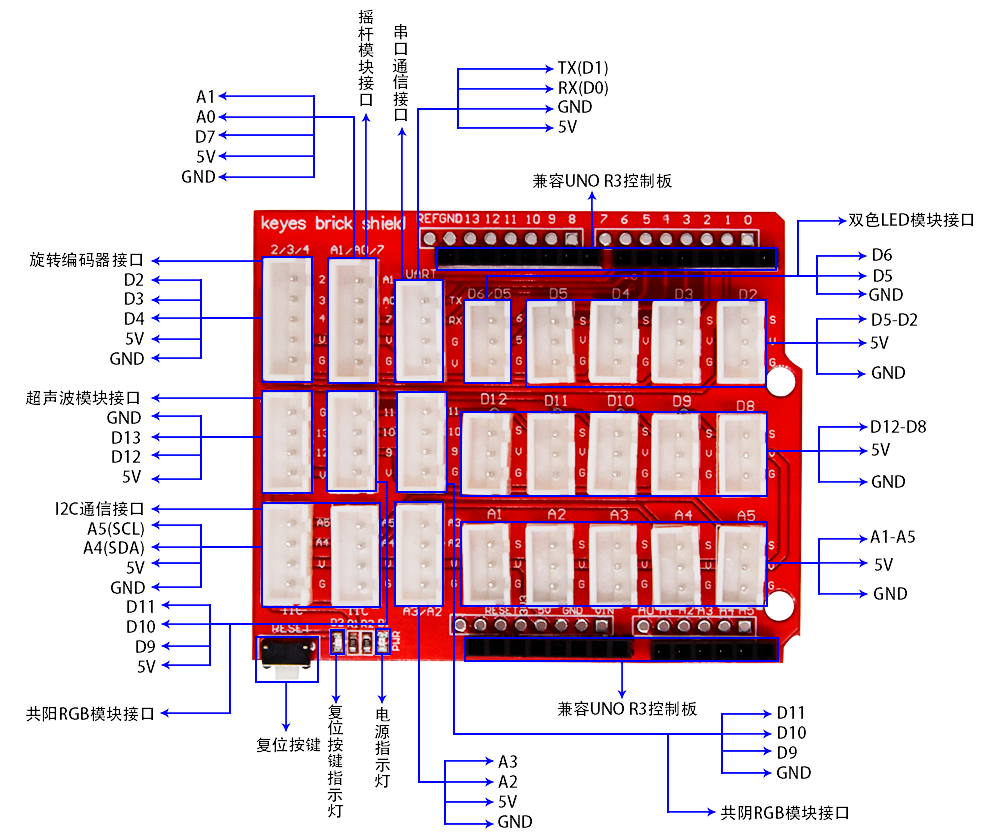
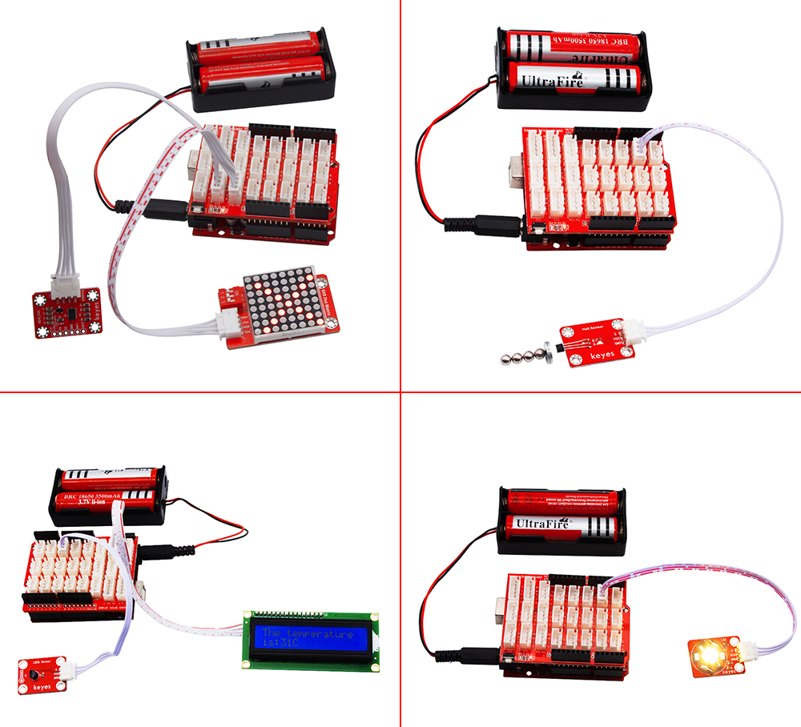

# KE1001 Keyes Brick Shield v1.0 传感器扩展板综合指南



---

## 1. 简介
KE1001 Keyes Brick Shield 传感器扩展板是一款专为 Arduino UNO R3 控制板设计的传感器扩展板，采用间距为 2.54mm 的防反插接口，方便用户连接各种传感器和模块。该扩展板的设计旨在简化接线过程，避免因线序接反而导致的设备损坏。

---

## 2. 特点
- **防反插设计**：采用防反插接口，确保连接线序固定，避免因接反而烧坏传感器/模块。
- **兼容性强**：与 Arduino UNO R3 控制板兼容，易于使用。
- **简化接线**：扩展板上所有接口均带有丝印，3-pin 接口标识为 G、V、S，其中 G 代表 GND，V 代表 VCC（5V），S 代表数字口/模拟口。
- **模块化设计**：扩展板两侧带有间距为 2.54mm 的排母接口，接线顺序与 UNO R3 板的排母接口一致，方便连接。
- **复位功能**：扩展板上自带一个复位按键和一个复位按键指示灯（D2），以及一个电源指示灯（D1）。
- **固定设计**：扩展板带有两个直径为 3mm 的定位孔，方便将扩展板固定在其他设备上。

---

## 3. 规格参数
- **工作电压**：DC 5V  
- **接口类型**：数字和模拟接口  
- **尺寸**：约 70mm x 55mm  
- **重量**：约 30g  

---

## 4. 接口
- **数字接口**：用于连接数字传感器和模块。
- **模拟接口**：用于连接模拟传感器。
- **电源接口**：为传感器和模块提供电源。



---

## 5. 连接图


### 引脚定义
- **GND (G)**：连接到 Arduino 的 GND 引脚。
- **VCC (V)**：连接到 Arduino 的 5V 引脚。
- **数字引脚 (S)**：用于连接各种数字传感器和模块。
- **模拟引脚**：用于连接各种模拟传感器。

---

## 6. 示例代码
以下是一个简单的示例代码，用于读取连接到扩展板的数字传感器（如按键模块）的状态：
```cpp
const int buttonPin = 2; // 按键连接到数字引脚 2
int buttonState = 0;     // 按键状态变量

void setup() {
  Serial.begin(9600);           // 初始化串口
  pinMode(buttonPin, INPUT);    // 设置按键引脚为输入
}

void loop() {
  buttonState = digitalRead(buttonPin); // 读取按键状态
  if (buttonState == HIGH) {             // 如果按键被按下
    Serial.println("Button Pressed!");  // 输出按键被按下的信息
  }
  delay(100); // 延时以避免抖动
}
```

---

## 7. 实验现象
上传程序后，按下连接到扩展板的按键模块时，串口监视器将输出 "Button Pressed!" 的信息，表示按键被成功读取。

---

## 8. 注意事项
- 确保传感器扩展板连接正确，避免短路。
- 在使用过程中，注意电源电压在 5V 范围内。
- 使用合适的库文件以确保程序正常运行。

---

## 9. 参考链接
- [Keyes 官方网站](http://www.keyes.com.cn)  
- [Arduino 官方网站](https://www.arduino.cc)  
