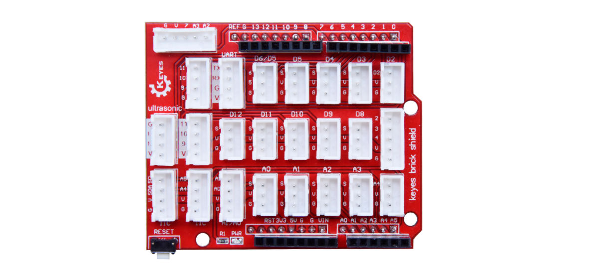
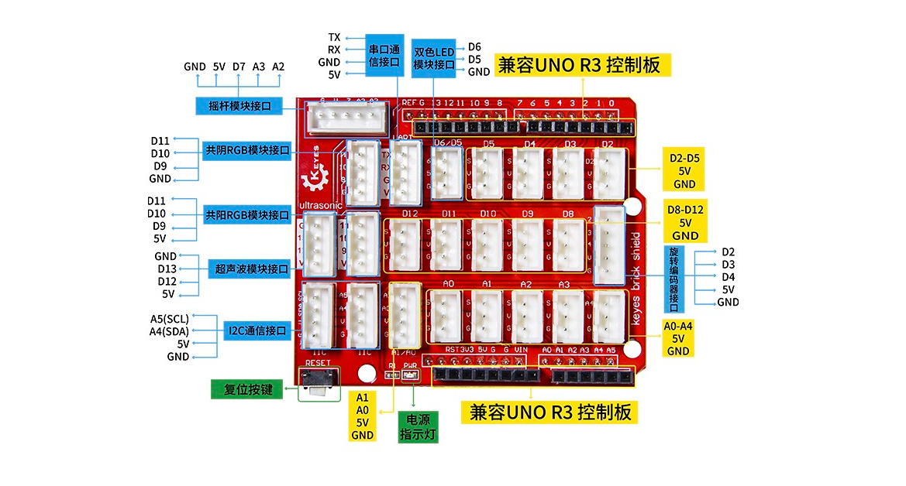
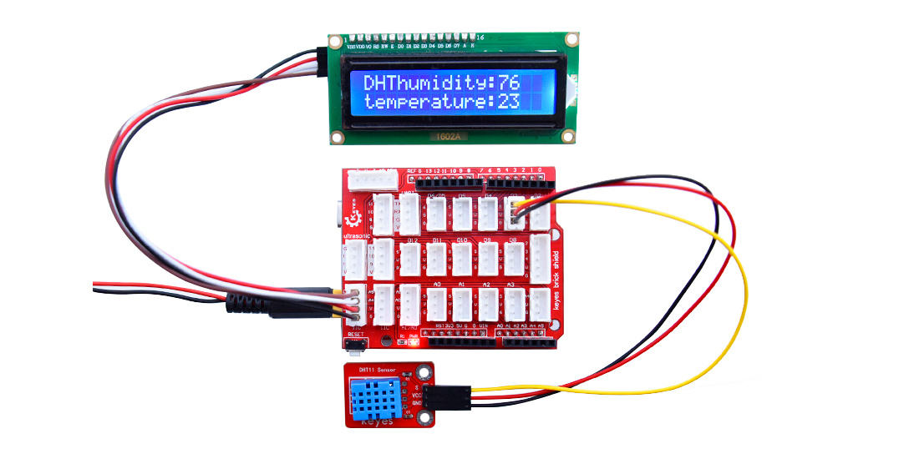

# KE1004 Keyes Brick Shield v2.0 传感器扩展板综合指南



---

## 1. 简介
KE1004 Keyes Brick Shield v2.0 传感器扩展板是基于 KE1001 版本的升级产品，专为 Arduino UNO R3 控制板设计。相比于 1.0 版本，v2.0 采用了更加优化和人性化的设计，提升了用户体验和操作便利性。扩展板仍然采用间距为 2.54mm 的防反插接口，确保用户可以方便地连接各种传感器和模块，使得电路搭建变得更加易于管理。新版本在简化接线过程方面进一步的提升，减少了因线序接反而导致的设备损坏风险。无论是在教育、原型开发还是个人项目中，KE1004 v2.0 都能够提供更加可靠和便捷的解决方案。

---

## 2. 特点
- **防反插设计**：采用防反插接口，确保连接线序固定，避免因接反而烧坏传感器/模块。
- **兼容性强**：与 Arduino UNO R3 控制板兼容，易于使用。
- **简化接线**：扩展板上所有接口均带有丝印，3-pin 接口标识为 G、V、S，其中 G 代表 GND，V 代表 VCC（5V），S 代表数字口/模拟口。
- **模块化设计**：扩展板两侧带有间距为 2.54mm 的排母接口，接线顺序与 UNO R3 板的排母接口一致，方便连接。
- **复位功能**：扩展板上自带一个复位按键。
- **固定设计**：扩展板带有两个直径为 3mm 的定位孔，方便将扩展板固定在其他设备上。

---

## 3. 规格参数
- **工作电压**：DC 5V  
- **接口类型**：数字和模拟接口  
- **尺寸**：约 70mm x 55mm  
- **重量**：约 30g  

---

## 4. 接口
- **数字接口**：用于连接数字传感器和模块。
- **模拟接口**：用于连接模拟传感器。
- **电源接口**：为传感器和模块提供电源。



---

## 5. 连接图


### 引脚定义
- **GND (G)**：连接到 Arduino 的 GND 引脚。
- **VCC (V)**：连接到 Arduino 的 5V 引脚。
- **数字引脚 (S)**：用于连接各种数字传感器和模块，此处温湿度传感器连接到 D3 引脚。
- **模拟引脚**：用于连接各种模拟传感器。

---

## 6. 示例代码
以下是使用 I2C 接口的 1602 LCD 显示器示例代码，用于显示温湿度传感器的数据，温湿度传感器连接到 D3 引脚：
```cpp
#include <Wire.h>
#include <LiquidCrystal_I2C.h>
#include <DHT.h>

#define DHTPIN 3     // 温湿度传感器连接到数字引脚 D3
#define DHTTYPE DHT11 // 选择 DHT11 传感器类型

DHT dht(DHTPIN, DHTTYPE); // 初始化 DHT 传感器
LiquidCrystal_I2C lcd(0x27, 16, 2); // 设置 I2C 地址（常见为 0x27）

void setup() {
  lcd.begin();              // 初始化 LCD
  lcd.backlight();         // 打开背光
  lcd.print("温湿度传感器"); // 显示欢迎信息
  dht.begin(); // 启动温湿度传感器
}

void loop() {
  float humidity = dht.readHumidity(); // 读取湿度值
  float temperature = dht.readTemperature(); // 读取温度值

  if (isnan(humidity) || isnan(temperature)) {
    lcd.setCursor(0, 1); // 移动光标到第二行
    lcd.print("读取错误"); // 显示错误信息
    return;
  }

  // 显示温度和湿度
  lcd.setCursor(0, 1); // 移动光标到第二行
  lcd.print("温度:");
  lcd.print(temperature);
  lcd.print("C ");
  
  lcd.setCursor(8, 1); // 移动光标到第二行的后半部分
  lcd.print("湿度:");
  lcd.print(humidity);
  lcd.print("% ");
  
  delay(2000); // 每 2 秒更新一次显示
}
```

---

## 7. 实验现象
上传程序后，通过串口监视器可以实时查看温湿度传感器的数据，同时在1602 LCD 显示器上也能显示温度和湿度的当前值。

---

## 8. 注意事项
- 确保传感器扩展板连接正确，避免短路。
- 在使用过程中，注意电源电压在 5V 范围内。
- 使用合适的库文件以确保程序正常运行。

---

## 9. 参考链接
- [Keyes 官方网站](http://www.keyes.com.cn)  
- [Arduino 官方网站](https://www.arduino.cc)  
